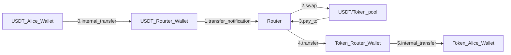
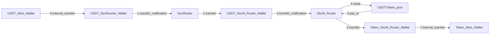

## dexRouter design logic flow chart

### stonfi jetton swap
ston.fi router: Jetton

```mermaid
flowchart LR;

USDT_Alice_Wallet --->|0.internal_transfer | USDT_Rourter_Wallet
USDT_Rourter_Wallet -->|1.transfer_notification| Router
Router -->|2.swap| USDT/Token_pool
USDT/Token_pool -->|3.pay_to| Router
Router -->|4.transfer| Token_Router_Wallet
Token_Router_Wallet --> |5.internal_transfer| Token_Alice_Wallet
```

dexRouter wrapped for ston.fi router: Jetton

```mermaid
flowchart LR;

USDT_Alice_Wallet --->|0.internal_transfer | USDT_DexRourter_Wallet
USDT_DexRourter_Wallet -->|1.transfer_notification| DexRouter
DexRouter --> |2.transfer| USDT_Stonfi_Router_Wallet
USDT_Stonfi_Router_Wallet --> |3.transfer_notification| Stonfi_Router
Stonfi_Router -->|4.swap| USDT/Token_pool
USDT/Token_pool -->|5.pay_to| Stonfi_Router
Stonfi_Router -->|6.transfer| Token_Stonfi_Router_Wallet
Token_Stonfi_Router_Wallet --> |7.internal_transfer| Token_Alice_Wallet
```